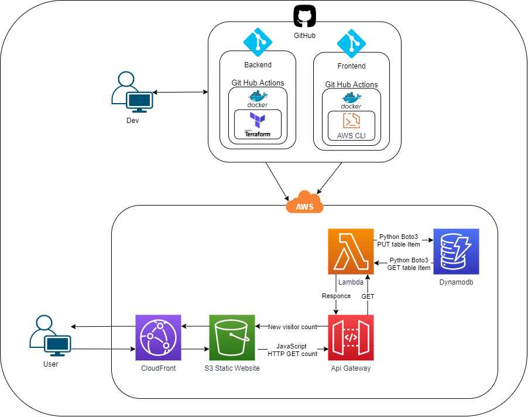

# Cloud Resume Challenge  

This is the Fontend portion of my take on building a solution to Forrest Brazeal's [Cloud-Resume-Challenge](https://cloudresumechallenge.dev/instructions/).  
Code Review for this Challenge is/was July 31, 2021.  
*Until code review, backend repo will be private as per challenge request.  
You can see the website progress here. Xaviercordovajr.com

## Instructions 

- [x] 1. **AWS Certification**  
- [x] 2. **HTML** - Resume needs to be written in HTML.  
- [x] 3. **CSS** - Resume needs to be styled with CSS.  
- [x] 4. **Static S3 Website**
- [x] 5. **HTTPS** - S3 Website URL should use HTTPS  
- [x] 6. **DNS** - Custom DNS domain name with CloudFront distribution.  
- [ ] 7. **Javascript** - Include visitor counter  
- [x] 8. **Database** - Store visitor count in a database.  
- [ ] 9. **API** - Connect web app and database through an API and Lambda.  
- [x] 10. **Python** - Use Python to create a lambda function. That will increment counter/DB count.  
- [ ] 11. **Tests** - Include some tests for your Python code.  
- [x] 12. **Infrastructure as Code** - I'm using Terraform  
- [x] 13. **Source Control** - Create separate private GitHub repository for backend & frontend code.  
- [x] 14. **CI/CD (Back end)** - Set up GitHub Actions for backend code.  
- [x] 15. **CI/CD (Front end)** - Setup GitHub Actions for frontend code. 

    

